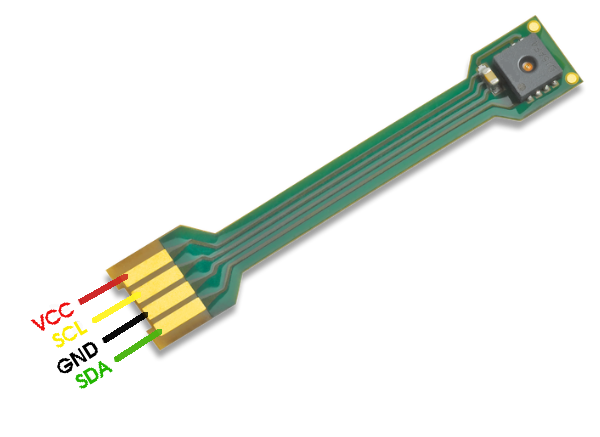

# Sensirion Nucleo I²C SHT4X Driver

The repository provides a driver for setting up a sensor of the SHT4X family to run on a Nucleo F103RB board over I²C.


Click [here](https://sensirion.com/products/catalog/SEK-SHT40/) to learn more about the Sensirion SHT4X sensor family.


## Supported sensor types

| Sensor name   | I²C Addresses  |
| ------------- | -------------- |
|[SHT40](https://sensirion.com/products/catalog/SHT40/)| **0x44**, 0x45|
|[SHT41](https://sensirion.com/products/catalog/SHT41/)| **0x44**, 0x45|
|[SHT45](https://sensirion.com/products/catalog/SHT45/)| **0x44**, 0x45|

The following instructions and examples use a *SHT40*.


## Connect the sensor to the Nucleo F103RB


Your sensor has 4 different connectors: SDA, GND, SCL, VDD.
Use the following pins to connect your SHT4X:

| *SHT4X* | *Cable Color*  |   *Nucleo F103RB*   |
| :----------------: | -------------- | ------------------ |
| SDA | green | Pin PB_9
| GND | black | Pin GND
| SCL | yellow | Pin PB_8
| VDD | red | Pin +3v3


**Note:**  *The Nucleo board does not contain internal pull-ups. Either you have a breakout board for your sensor 
    that has pull-ups, or you have to add pull-ups by our own.
    The provided setup assumes that ~5K pull-ups are installed. As the required pull-ups heavily depend on your actual 
    hardware setup (e.g. length wires), it's a good thing to check the signals SCL and SDA with an oscilloscope.*

### Detailed sensor pinout



| *Pin* | *Cable Color* | *Name* | *Description*  | *Comments* |
|-------|---------------|:------:|----------------|------------|
| 1 | green | SDA | I2C: Serial data input / output | 
| 2 | black | GND | Ground | 
| 3 | yellow | SCL | I2C: Serial clock input | 
| 4 | red | VDD | Supply Voltage | 1.1V to 3.6V


### Using the SHT4X with a X-NUCLEO-IKS02A1 shield

If you have a X-NUCLEO-IKS02A1 expansion shield and the SHT4X mounted on a SENSEVAL-MKI4XV1 pcb you can
plug it as shown in the following picture.


In this way you are assured that you have appropriate pull-ups.


## Quick start example

As with any embedded project, the setup is a bit more challenging than just building an application on a linux or windows host.

First, we need a driver for the board. Next we need a compiler for the selected MCU and some tools to combine all steps
that are needed to build a working image. We need an appropriate hardware setup.
Finally, we need a tool to flash a successfully built image on the device and a serial terminal to see, if the code that we loaded 
on the MCU does some meaningful things.

In the rest of this section we will guide you through the process of setting up everything:

- [Download and install the *ST-LINK Driver*](https://www.st.com/en/development-tools/stsw-link009.html):

    This is the software you need to connect your Nucleo board with your PC.
    You will need to register in order to download the driver.
    (Used version for this setup: 2.0.2)

- [Download and install the STM Cube Programmer](https://www.st.com/en/development-tools/stm32cubeprog.html):

    This is the software that will load a built application onto the flash of the board.
    (Used version for this setup: 2.11.0)


- [Install the gnu arm embedded toolchain](https://developer.arm.com/downloads/-/gnu-rm):

    The provided examples come with a makefile that uses the gnu toolchain for arm embedded.

    <details><summary>Instructions for Windows users</summary>
    <p>
        In case you are working on Windows you will need to have access to a working gnu tool-set. 
        This you can either achieve by installing [cygwin](https://www.cygwin.com/install.html) or more 
        convenient [WSL](https://learn.microsoft.com/en-us/windows/wsl/install). 
        [Mingw](https://www.mingw-w64.org) will work for compiling as well but `make clean` will fail since 
        removing recursive directories is not properly supported.
    </p>
    </details>

    


- Download the SHT4X driver from [GitHub](https://github.com/Sensirion/nucleo-i2c-sht4x):

    Extract the `.zip` on your PC.
    The structure of the extracted zip file is described in more detail in the section [Folder structure](#folder-structure)


- Check entries in the file `user_settings.mak`:

    The file contains settings that are used by the build process and that may be specific to your installation.


- Connect the hardware:

   Connect the Nucleo board over USB to your PC and your sensor to new Nucleo board according to section 
   [Connect the sensor](#connect-the-sensor-to-the-nucleo-f103rb).


- Setup a serial terminal:
    A serial terminal is required to get the output from your application. 
    The serial terminal needs to use the virtual com port from the installed ST-LINK. The used settings are:

        baud-rate = 115200
        parity = None
        data-bits = 8

    The example applications will output ascii strings. Each line will be ended by a `'\n'` character.


- Build and flash the application:
    Open a terminal in the folder that contains this readme and the file `Makefile`.

    By executing the command

        make TARGET=example-usage flash

    the example in the sub-folder `example-usage` will be built and directly flashed onto the Nucleo board.
    The flashing will reset the board, and you should see the output of the application on your serial terminal.

## Folder structure

The provided driver package comes with ready to use
examples. This includes a valid configuration and initialization of 
the hardware and the Nucleo board.
In case you want to extend the examples you may need to change that configuration. 
Therefore, it is important to understand the folder structure of the driver package.

The folder structure is as follows:

    nucleo-i2c-SHT4X/
        example-usage/
        images/
        nucleo_f103rb/
            Drivers/
            Core/
        sensirion/

The folder `images` contains images needed by this read-me and is not relevant for any application.
The folder `example-usage` contains the default usage example. It depends on the objects that are built from the folder `sensirion` and `nucleo_f103rb`


### Folder nucleo_f103rb

The folder `nucleo_f103rb` contains the resources that where generated by the application 
[STM32CubeMx](https://www.st.com/en/development-tools/stm32cubeprog.html). This application
lets you define the hardware setup for a specific board and generate the source code with all configurations and drivers.

The sub-folder `Drivers` contains the hardware drivers of peripherals and the sub-folder `Core` contains the setup and configuration for any
example in this driver package.

The configuration file `Nucleo_F103RB.ioc` used by the STM32CubeMx software is the base for all the provided artifacts within this folder.
The current configuration includes the following choices for communication:

- Select I2C block 1 and map it to PB_8  and PB_9.


- Select UART block 2 and map it ot PA_2(TX) and PA_3(RX).

  This selection will allow you to use the virtual COM port of the ST-LINK (over USB) 
  to trace out print statements.


To see the complete configuration install the program [SMT32CubeMx](https://www.st.com/en/development-tools/stm32cubeprog.html) 
and open the file `Nucleo_F103RB.ioc`.


The contents of the function `main()` and the initialization of the I2c peripheral `MX_I2C1_Init()` are not used as 
generated in the folder `Core` but integrated in the file `sensirion_i2c_hal.c`.

### Folder sensirion

The folder sensirion contains the framework that is used by the usage examples. It provides functions to initialize the hardware and to communicate with the sensors.


## Troubleshooting

### Building or flashing driver failed

- Make sure that all the prerequisites are properly installed.
- Make sure that the settings in the file `user_settings.mak` are matching your installation. 
- Check if the COM port used by the serial terminal corresponds to the COM port established by ST-LINK.

### Communication with the sensor failed

- Make sure that your sensor is properly connected to your board including appropriate pull-ups.


## Contributing

**Contributions are welcome!**

We develop and test this driver using our company internal tools (version
control, continuous integration, code review etc.) and automatically
synchronize the master branch with GitHub. But this doesn't mean that we don't
respond to issues or don't accept pull requests on GitHub. In fact, you're very
welcome to open issues or create pull requests :)

This Sensirion library uses
[`clang-format`](https://releases.llvm.org/download.html) to standardize the
formatting of all our `.c` and `.h` files. Make sure your contributions are
formatted accordingly:

The `-i` flag will apply the format changes to the files listed.

```bash
clang-format -i *.c *.h
```

Note that differences from this formatting will result in a failed build until
they are fixed.


# License

See [LICENSE](LICENSE).